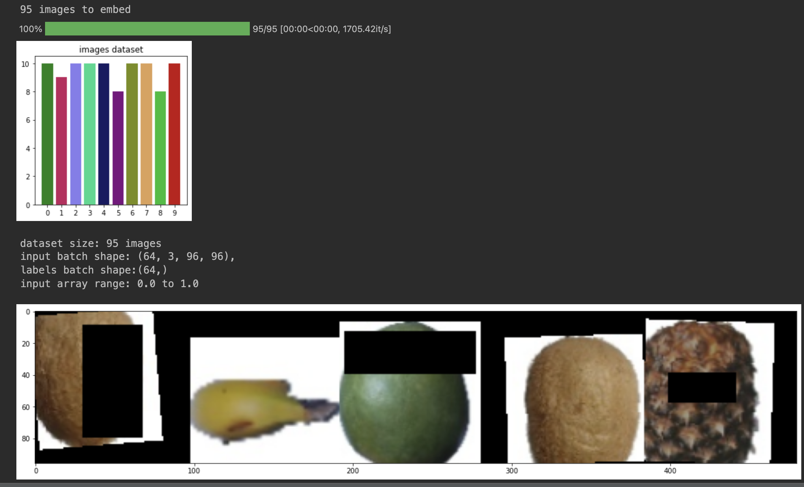

# PyTorch custom dataloader

This repository represents custom dataloader in pytorch and 
supporting data preparation functions

## Installation
### Requirements
To install run:
```bash
$ pip install -r requirements.txt
```

## Data Preparation

### Download
Dwonload and move fruits/ folder in project directory
```bash
$ git clone https://github.com/somesh-scoville/datasets
```

### Prepare dataset
```bash
$ python3 prepare_dataset.py
```

### Generate and Test dataloader
```bash
$ python3 dataloader.py
```

